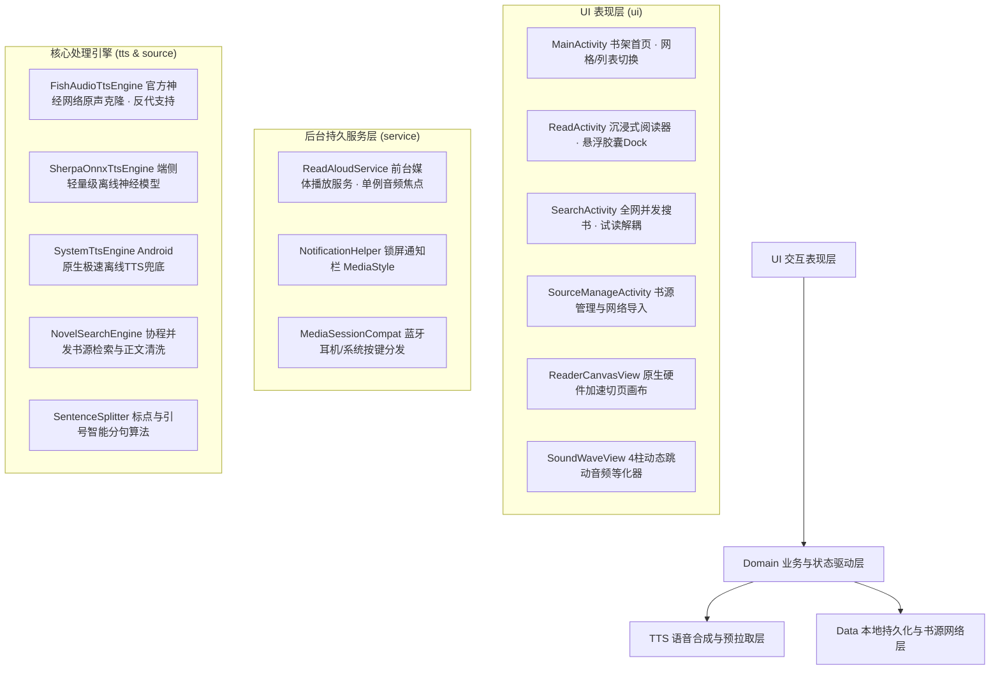

<div align="center">

# 📖 灵阅 AI · AI Reading

**全新一代轻量、高质感 Android 小说阅读与拟真 AI 声情朗读器**

*深度集成奶龙 & 大狗叫官方原声与端侧离线神经模型 · 原生硬件加速切页画布 · 熄屏持久后台发音 · 开源书源并发聚合检索*

<p align="center">
  <a href="https://github.com/lzcjyx/aireading/releases"></a>
  <a href="#"></a>
  <a href="#"></a>
  <a href="#"></a>
  <a href="LICENSE"></a>
</p>

</div>

---

## 💡 项目简介与设计哲学

在传统手机小说阅读软件中，读者常常饱受**界面广告杂乱、机械死板的机器人 TTS、卡顿耗电的 WebView 排版、以及熄屏放入口袋后被系统杀后台**等痛点的困扰。

**灵阅 AI (AI Reading)** 专为纯粹的小说阅读与有声沉浸体验而生，采用极具现代质感的**极夜黑曜石 & 琥珀香槟金 (Obsidian & Amber Gold)** 极简美学设计，深度融合端侧轻量化神经计算与全网开源书源生态：

- 🐉 **明星专属拟真声线**：集成高保真少儿动漫呆萌 **奶龙** 原声与魔性爆笑 **大狗叫** 原声，提供 **Fish Audio 神经网络克隆** 与 **Sherpa-ONNX 端侧轻量离线模型** 双轨支持，配合 14MB 轻量模型包，无需联网零流量畅听；
- 📊 **智能多级发声调度与透明看板**：自适应多级容灾架构（Fish AI 深度原声 ➔ 自定义私有 API ➔ 端侧离线轻量模型 ➔ 系统原生 TTS 极速兜底），毫秒级自动容灾切换，界面实时透明显示当前生效发声通道；
- ⚡ **原生硬件加速阅读画布**：自主研发高性能 `ReaderCanvasView`，彻底弃用臃肿的 WebView，支持 240ms 仿真减速平滑横向翻页、逐句微光圆角跟随高亮与 4 款精选护眼主题；
- 🌙 **熄屏持久后台播放与单例焦点管理**：基于 Android 前台媒体服务 `ReadAloudService`、`PARTIAL_WAKE_LOCK`、`MediaSessionCompat` 与**全局单例音频焦点管理**，完美支持锁屏控制、蓝牙耳机线控与毫秒级平滑断点续播；
- 🌐 **全网开源书源生态兼容**：无缝兼容 Legado（开源阅读 3.0）书源规范，支持 HTTP/HTTPS 订阅链接一键网络导入，内置免配置高速书源，协程全网并发检索与智能正文清洗；
- 📚 **书架与试读机制解耦**：搜书试读绝不自动入架，只有用户主动点击收藏才持久化保存；提供经典 3 列 3D 网格书架与详细卡片列表双重视图。

---

## 🚀 核心功能与亮点

| 功能模块 | 核心特性 | 技术方案与体验优势 |
| :--- | :--- | :--- |
| **明星 AI 声情 TTS** | 🐉 奶龙（呆萌龙宝原声）<br>🐕 大狗叫（100% 原版魔性原声）<br>⚡ 私有克隆 / 📱 系统原生 | 支持 **Fish Audio 官方原声大模型**（支持填入个人 API Key 与国内反代镜像地址）；支持 **Sherpa-ONNX 端侧轻量模型**（仅需 14MB 离线包，永久免费零流量秒播）；支持自建 GPT-SoVITS 远程推理；支持系统原生 TTS 极速兜底。 |
| **智能发声看板** | 实时发声通道大字提示<br>4 秒弱网超时秒级无感降级<br>状态透明联动 | 音色声卡与阅读器界面实时标明当前出声通道（`Fish AI`、`端侧离线`、`自定义API`、`系统TTS`）；针对海外 API 设置 4 秒快速超时，网络波动时自动秒级切入本地离线模型，绝不卡死阅读。 |
| **原生阅读画布** | 240ms 水平仿真翻页动画<br>微光圆角逐句跟随高亮<br>4 款护眼与 OLED 专业主题 | 纯原生 Android Canvas 排版与文字测量；屏幕左侧 30% 上一页、右侧 30% 下一页、中间 40% 唤出菜单；支持左右滑动手势翻页；朗读至页末自动无感平滑跨页翻转；支持 14sp ~ 32sp 无级字号调节。 |
| **熄屏长久后台听书** | 锁屏/通知栏 MediaStyle 控制卡片<br>耳机与车载按键精准接管<br>真·暂停与平滑断点恢复 | 前台媒体播放服务结合 CPU `PARTIAL_WAKE_LOCK` 杜绝系统休眠中断；**单例音频焦点管理**保证暂停期间保留焦点，再次点击播放瞬间无缝断点续播，彻底根治“读半个字立刻暂停”的底层竞争 Bug。 |
| **开源书源与全网搜书** | 兼容 Legado 开源阅读规范<br>URL 订阅 / JSON 批量导入<br>多源并发秒级检索与解析 | 协程高并发多源网络爬虫，流式实时聚合返回；详情弹窗预览目录与直接试读；**搜书与书架彻底解耦**，试读绝不强制自动入架，满意后手动一键加入。 |
| **质感书架与排版** | 详细列表 / 3列立体网格视图<br>多维度排序（阅读时间/书名）<br>长按书籍快捷管理菜单 | 3D 立体书脊封面光影；超细平滑阅读进度指示；长按支持开启阅读、清理本地缓存、彻底从书架移除。 |
| **交互与微动效细节** | 悬浮深黑毛玻璃胶囊 Dock<br>4 柱自适应跳动音频等化器<br>NestedScrollView 嵌套滑动 | 朗读时动态跳动音频频谱，`onDraw` 绘制过程零内存分配；悬浮控制栏配置防点击穿透；音色设置弹窗采用 `NestedScrollView`，彻底消除上下滑动手势冲突。 |

---

## 🏗️ 架构设计与目录规范

项目遵循 Google 官方推崇的 **Clean Architecture + MVI / Coroutines Flow** 响应式架构：



### 📁 项目工程代码树

```
com.vibecoding.aireading
├── App.kt                           # 全局 Application 入口
├── data/
│   └── BookRepository.kt            # 书架存储、章节目录/正文磁盘缓存、删除与清理
├── model/
│   ├── Book.kt                      # 小说实体模型（包含网络源/本地路径、封面颜色、进度）
│   ├── BookSource.kt                # 开源书源规则配置实体（兼容 Legado 核心规范）
│   ├── Chapter.kt                   # 章节实体（包含正文文本与细粒度分句列表）
│   ├── Sentence.kt                  # 句子实体（起止偏移、文本内容）
│   ├── VoiceConfig.kt               # 声音角色与语速音调配置模型
│   └── PlaybackState.kt             # 播放状态模型（响应式 StateFlow 全局驱动）
├── parser/
│   ├── SentenceSplitter.kt          # 标点符号、对话引号与句法边界智能分句器
│   └── TxtBookParser.kt             # 本地 TXT 文件自动编码识别与正则分章器
├── source/
│   ├── BookSourceParser.kt          # Jsoup CSS/JSON 规则提取与智能清洗引擎
│   ├── BookSourceRepository.kt      # 书源存储管理、免配置预设源与 URL 订阅导入
│   └── NovelSearchEngine.kt         # Kotlin 协程高并发全网多源检索与正文爬虫
├── tts/
│   ├── ITtsEngine.kt                # 统一 TTS 引擎接口规范
│   ├── FishAudioTtsEngine.kt        # Fish Audio 官方神经网络原声克隆引擎（支持反代）
│   ├── GptSovitsTtsEngine.kt        # 自建 GPT-SoVITS / CosyVoice API 远程推理引擎
│   ├── SystemTtsEngine.kt           # Android 原生离线 TextToSpeech 备用引擎
│   ├── TtsManager.kt                # 多引擎自适应调度、双缓冲预拉取与 LRU 磁盘缓存
│   └── sherpa/                      # Sherpa-ONNX 端侧轻量级离线神经模型管理器与合成器
│       ├── SherpaModelManager.kt    # 离线模型包下载解压与就绪校验（奶龙/大狗叫 14MB 离线包）
│       └── SherpaOnnxTtsEngine.kt   # VITS 离线 ONNX 推理、FST 拼音分词与端侧极速发音
├── service/
│   ├── ReadAloudService.kt          # 熄屏长久运行前台服务（WakeLock + 单例 AudioFocus + MediaSessionCompat）
│   └── NotificationHelper.kt        # 系统通知栏与锁屏界面多媒体控制器（MediaStyle）
└── ui/
    ├── MainActivity.kt              # 首页：Hero 品牌顶栏、网格/列表切换、书架长按删除
    ├── ReadActivity.kt              # 阅读器：沉浸式画布、悬浮 Dock、动态声波与 4 款护眼主题
    ├── SearchActivity.kt            # 搜书：多源并发检索、热门推荐词与流式搜索结果呈现
    ├── SourceManageActivity.kt      # 书源管理：启停开关、删除与订阅链接批量导入
    ├── adapter/                     # 列表适配器 (BookAdapter, ChapterAdapter, SearchResultAdapter, SourceAdapter)
    ├── dialog/                      # 交互弹窗 (VoiceSelectDialog, BookDetailDialog, TocBottomSheetDialog, ImportUrlDialog)
    └── view/
        ├── ReaderCanvasView.kt      # 原生硬件加速阅读画布（240ms 水平翻页、逐句微光高亮）
        └── SoundWaveView.kt         # 4 柱动态跳动音频频谱等化器波形控件
```

---

## 📥 安装与快速上手

### 方式一：下载 APK 直接安装（推荐）

前往 [GitHub Releases 页面](https://github.com/lzcjyx/aireading/releases) 下载最新版 `AI_Reading_Novel.apk` 即可安装：

- **系统要求**：Android 8.0 及以上（API 26 ~ API 34+）；
- **图标适配**：已完整适配 Android 8.0+ 自适应图标（黑曜金立体质感图标），告别白边方块；
- **权限说明**：首次打开请授予“通知权限”，以便在手机锁屏或通知栏接管播放控制器。

> [!TIP]
> 📥 **直接下载安装包**：[AI_Reading_Novel.apk](https://github.com/lzcjyx/aireading/releases/download/v1.0.0/AI_Reading_Novel.apk)

### 方式二：从源码编译构建

```bash
# 1. 克隆代码仓库
git clone https://github.com/lzcjyx/aireading.git
cd aireading

# 2. 执行核心单元测试（分句算法、书源规则、TTS调度校验）
./gradlew testDebugUnitTest

# 3. 编译 Debug 安装包
./gradlew assembleDebug

# 生成的安装包路径：app/build/outputs/apk/debug/app-debug.apk
```

---

## 📖 使用指南

### 1. 音色配置与多级发声通道

点击阅读器顶部的音色胶囊按钮（如 `🐉 奶龙`），即可呼出音色设置面板：

1. **方案一：100% 免费端侧离线语音包（推荐，免梯子免流量）**
   - 在音色弹窗中点击 **「💾 下载离线语音包」**；
   - 系统将自动下载解压缩仅约 14MB 的 Sherpa-ONNX 离线模型包，下载完成后状态变为 **「🟢 离线就绪」**；
   - 此后无需联网、无需 Key、零流量消耗，在飞机、地铁等无网弱网环境下均可秒级发音。
2. **方案二：Fish Audio 官方原声克隆模型（最逼真原声）**
   - 前往 [Fish Audio 官网](https://fish.audio) 获取免费个人 API Key 并填入输入框；
   - **网络优化**：由于海外 Anycast 节点在国内网络下偶有延迟，若开启科学上网可享受极致秒播；若国内直连，支持在**「反代/镜像接口」**选填框中填入自建反代域名；
   - 若网络发生丢包，系统会在 4 秒超时后**自动无感切入端侧离线模型或系统 TTS**，绝不中断听书。
3. **方案三：手机系统原生 TTS**
   - 切换至「系统原生 TTS」，零额外消耗，即点即读。
4. **看板透明化**：
   - 弹窗顶部常驻卡片与阅读器状态栏会实时显示最终出声引擎（如 `🐉 奶龙 [Fish AI]`、`🐉 奶龙 [端侧离线]`、`📱 系统 [离线TTS]`）。

### 2. 全网搜书与试读收藏

1. 首页点击 **「🔍 全网搜书」**，输入小说名（如《斗破苍穹》、《完美世界》）或点击热门推荐；
2. 协程并发搜索启用的所有书源，按相关度智能排序展示；
3. 点击书籍卡片弹出详情，可直接点击 **「📖 立即阅读」** 进入试读，**试读不会误加书架**；
4. 满意后点击阅读器顶部的 **「📥 入架」** 或弹窗中的 **「+ 放入书架」**，即可将书籍永久收藏至本地书架。

### 3. 网络书源导入与管理

1. 首页点击 **「🌐 书源配置」** 进入书源列表；
2. 点击右上角 **「网络导入」**，粘贴支持 Legado（阅读 3.0）的 JSON 书源订阅链接或书源文本；
3. 点击确定，系统自动校验格式并批量导入，支持单个书源独立启停与滑动管理。

### 4. 阅读器手势与交互控制

1. **翻页手势**：
   - 轻触屏幕**左侧 30%** 区域：翻回上一页；
   - 轻触屏幕**右侧 30%** 区域：翻到下一页；
   - 轻触屏幕**中间 40%** 区域：唤出或收起上下悬浮控制条；
   - 支持手指水平左右拖拽仿真翻页；
2. **段落跳转与精准定位**：
   - 轻触页面上任意一句文字，AI 朗读立即跳转至该句继续播报；
   - 拖动底栏进度条可快速跨段寻道。
3. **背景主题与字号**：
   - 浮层展开后，底栏支持切换 4 款主题：复古羊皮纸、清雅水墨绿、极夜深黑、经典素白；
   - 点击 `A-` / `A+` 按钮自由调整字体大小。

---

## 🛠️ 技术选型规格

| 维度 | 技术选型 | 考量与优势 |
| :--- | :--- | :--- |
| **编程语言** | Kotlin 1.9 + Coroutines Flow | 结构化并发、响应式状态分发、非阻塞 IO |
| **排版绘制** | Android Native Hardware Canvas | 自主掌控排版逻辑与字距行距，240ms 水平减速切页，微光圆角跟随高亮 |
| **端侧离线推理** | Sherpa-ONNX + VITS | 14MB 超轻量端侧神经模型，零流量零网络开销，本地秒级合成 |
| **云端高保真克隆** | Fish Audio Neural Engine | 官方授权模型声线，原汁原味还原角色情感语调，支持反代镜像配置 |
| **后台持久与焦点** | Foreground Service + MediaSessionCompat + WakeLock | 单例音频焦点监听器杜绝竞争 Bug，锁屏/耳机线控精准接管，熄屏稳定保活 |
| **网络通信与抓取** | OkHttp 4.12.0 + Jsoup 1.17.2 | 连接池复用、超时快速降级、容错 HTML/CSS/JSON 规则解析 |

---

## 📄 开源许可证

本项目遵循 [MIT License](LICENSE) 开源协议。

欢迎 Star 🌟 与 Fork！如有任何建议或问题，欢迎在 [Issues](https://github.com/lzcjyx/aireading/issues) 中交流反馈！
